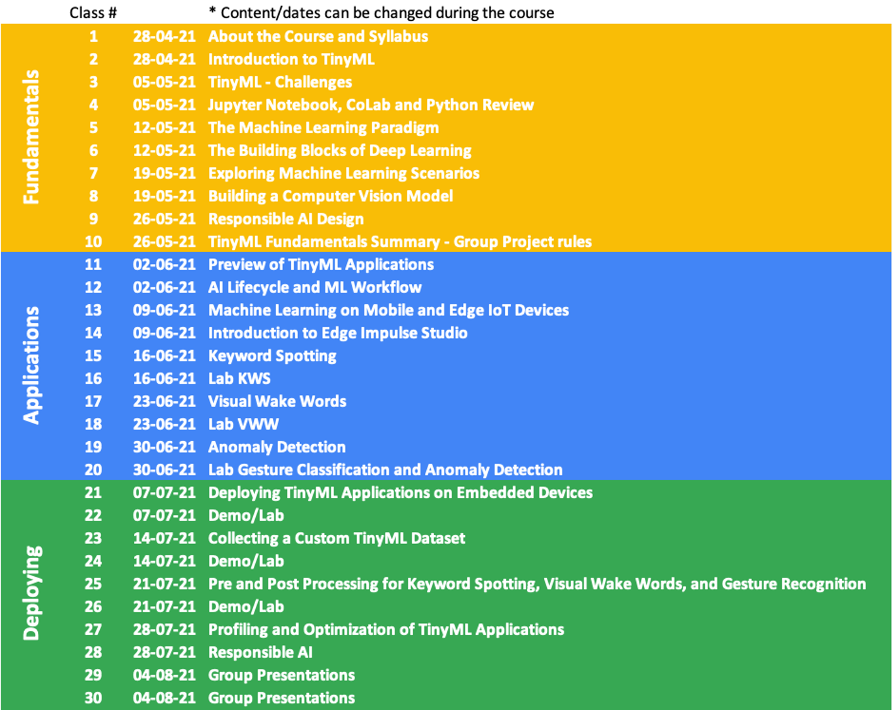
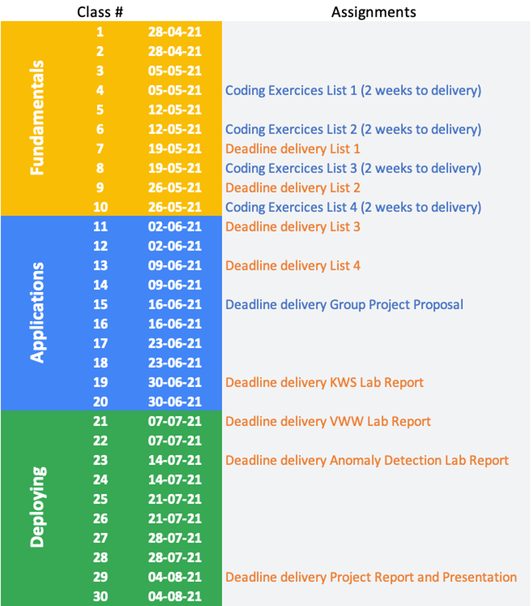

# UNIFEI-IESTI01-T01-2021.1
## Course Repository - TinyML - Machine Learning for Embedding Devices

<figcaption><a href='https://unifei.edu.br/iesti/'>Instituto de Engenharia de Sistemas e Tecnologias da Informação – IESTI - Campus de Itajubá</a></figcaption>

`
NOTA: O curso será ministrado majoritariamente em português, mas uma base de inglês será fundamental ao aluno para o acompanhamento do mesmo, pois todo o material de leitura, vídeos e slides, serão disponibilizados no idioma inglês.`

## Visão geral do curso

TinyML é um curso introdutório na interseção entre o Aprendizado de Máquina (Machine Learning) e dispositivos embarcados (Embedded Devices). A difusão de dispositivos embarcados com ultra-baixo consumo de energia (da ordem de miliwatts), juntamente com a introdução de frameworks de aprendizado de máquina dedicados a dispositivos embarcados, como TensorFlow Lite para Microcontroladores (TF Micro), permitirá a proliferação em massa de dispositivos IoT potencializados por IA (“AioT”). 

O crescimento explosivo do aprendizado de máquina e a facilidade de uso de plataformas como TensorFlow (TF) o tornam um tópico de estudo indispensável para estudantes de Engenharia Eletrônica, da Computação e Controle & Automação. 

O TinyML difere do aprendizado de máquina convencional (por exemplo, servidor - nuvem) porque requer não apenas conhecimentos em software, mas também conhecimentos em hardware integrado. Este curso procura fornecer uma base para o entendimento deste campo emergente.

A atual versão deste curso, pioneiro na América Latina, tem como principais referências:
+ [Harvard School of Engineering and Applied Sciences - CS249r: Tiny Machine Learning](https://sites.google.com/g.harvard.edu/tinyml/home)
+ [Professional Certificate in Tiny Machine Learning (TinyML) – edX/Harvard](https://www.edx.org/professional-certificate/harvardx-tiny-machine-learning)
+ [Introduction to Embedded Machine Learning (Coursera)](https://www.coursera.org/learn/introduction-to-embedded-machine-learning)
+ Text Book: ["TinyML" by Pete Warden, Daniel Situnayake](https://www.oreilly.com/library/view/tinyml/9781492052036/)

IESTI01 faz parte do [TinyML4D](https://tinymlx.org/TinyML4D/), uma iniciativa para tornar a ensino do TinyML disponível para todos em todo o mundo.

## Tópicos do curso

+	Fundamentos de IoT
+	Fundamentos de aprendizado de máquina (ML)
+	Fundamentos de Deep Learning (DL)
+	Como coletar dados para ML
+	Como treinar e implantar modelos de ML
+	Noções básicas sobre ML embarcado
+	O código por trás de alguns dos aplicativos mais amplamente utilizados no TinyML
+	Casos reais de aplicação do TinyML na indústria
+	Princípios de reconhecimento automático de fala (KeyWord Spotting como Alexa, Hey Google, Siri, etc.)
+	Princípios do reconhecimento automático de imagens (Visual Wake Words)
+	Conceito de detecção de anomalias e modelos de ML aplicáveis 
+	Princípios de Engenharia de Dados aplicado ao TinyML
+	Visão geral do hardware de dispositivos baseados em microcontroladores
+	Visão geral do software por trás de dispositivos baseados em microcontroladores
+	Projetos reais utilizando plataformas de mercado
+	Design, desenvolvimento e Implantação de uma IA responsável

## Carga horária: 
+	30hs (Classes de 2hs, durante 15 semanas) 
+	15hs de tarefas/labs
+	15hs em pesquisas e estudos individuais + trabalho final (em grupo)

## Processo de aprovação:
+ Participação individual em classe: 10%
+	Listas de exercícios (Jupyter Notebook): 30%
+	Projetos práticos (Labs): 30%
+	Projeto Final (com apresentação): 30%

## Pré-requisitos
+ Conhecimentos do idioma inglês (leitura).
+ Conhecimentos básicos de programação em  C / C ++ (Arduino IDE) e Python. Todas as tarefas de classe envolverão uma ou ambas linguagens de programação.
+ Familiaridade com ferramentas de linha de comando em Mac, Windows ou Linux. Os projetos exigirão operações em um terminal.
+ Noções de Algebra linear, probabilidade básica e estatística. Muitos tópicos de ML giram em torno de compreender operações e notação de vetores e matrizes, bem como conceitos de distribuições gaussianas, médias, desvios-padrão etc.

## Metodologia/Recursos: 
+ As aulas serão ministradas de maneira remota e ao vivo (aulas síncronas) pela plataforma Google Meet, todas as quartas-feiras das 16:30h às 18:30h. As gravações das aulas estarão disponíveis aos alunos para revisão. 
+ Exercícios e projetos poderão ser desenvolvidos em computadores pessoais com TensorFlow V.2x instalados ou utilizando-se de ferramentas on-line como [Google CoLab](https://colab.research.google.com/notebooks/intro.ipynb).
+ Modelos reais de TinyML serão desenvolvidos e treinados utilizando-se do [Edge Impulse Studio](https://www.edgeimpulse.com/).
+ Para a captura de dados e deployment dos modelos treinados (Parte 2) deverão ser utilizados smart-phones pessoais dotados de pelo menos sensores do tipo: acelerômetro, microfone e camera.
+ Na parte 3 do curso será também utilizado um Kit composto de um Arduino BLE Sense (Cortex-M4) e uma camera digital modelo OV7675 (disponibilizado pela universidade e enviado diretamante aos alunos). 

## Professor do curso:
+ [Marcelo José Rovai](https://medium.com/@rovai)

## Supervisão e apoio:
+ [Maurilio Pereira Coutinho](http://lattes.cnpq.br/8563634195134747)
+ [José Alberto Ferreira](http://lattes.cnpq.br/8319509175327154)

## Planejamento das Classes (Turma 1 - 2021.1)

## Planejamento das Tarefas/Trabalhos (Turma 1 - 2021.1)

## Material (All in English)
`All material will be uploaded to this repo at the classes' base.`

### Optional pre-course activities:
+ Pre-course:  : [[Suggested readings]](00_Curso_Folder/0_Pre-Course/)
+ Pre-course:  : [[Jupyter Notebook, CoLab and Python Review]](/00_Curso_Folder/1_Fundamentals/Class_4/)

### Parte 1: Fundamentals 
+ Class 1 - About the Course and Syllabus [[Slides]](00_Curso_Folder/1_Fundamentals/Class_1/IESTI01_TinyML_class_1.pdf) [[Video]](https://youtu.be/xjhSqpBugcA)
+ Class 2 - Introduction to TinyML [[Slides]](00_Curso_Folder/1_Fundamentals/Class_2/IESTI01_TinyML_class_2.pdf) [[Video]](https://youtu.be/cjuvCVLIx58)
+ Class 3 - TinyML - Challenges [[Slides]](00_Curso_Folder/1_Fundamentals/Class_3/IESTI01_TinyML_class_3.pdf)[[Extras]](00_Curso_Folder/1_Fundamentals/Class_3/) [[Video]](https://youtu.be/PBJtvBaX2_w)
+ Class 4 - Jupyter Notebook, CoLab and Python Review [[Docs]](00_Curso_Folder/1_Fundamentals/Class_4/docs/) [[Notebooks]](00_Curso_Folder/1_Fundamentals/Class_4/) [[Video]](https://youtu.be/tEp6hEOOT8Y)
+ Class 5 - The Machine Learning Paradigm [[Slides]](00_Curso_Folder/1_Fundamentals/Class_5/IESTI01_TinyML_class_5.pdf) [[Docs]](00_Curso_Folder/1_Fundamentals/Class_5/docs/) [[Video]](https://youtu.be/E3tw9wpaAHg)
+ Class 6 - The Building Blocks of Deep Learning - Regression with DSS [[Slides]](00_Curso_Folder/1_Fundamentals/Class_6/IESTI01_TinyML_class_6.pdf) [[Docs]](00_Curso_Folder/1_Fundamentals/Class_6/docs/) [[Video]](https://youtu.be/VAIkoEZsJGk)
+ Class 7 - Exploring Machine Learning Scenarios
+ Class 8 - Building a Computer Vision Model
+ Class 9 - Responsible AI Design
+ Class 10 - TinyML Fundamentals Summary - Group Project rules!

### Parte 2: Applications
+ Class 11 - Preview of TinyML Applications
+ Class 12 - AI Lifecycle and ML Workflow
+ Class 13 - Machine Learning on Mobile and Edge IoT Devices
+ Class 14 - Introduction to Edge Impulse Studio
+ Class 15 - Keyword Spotting
+ Class 16 - Lab KWS
+ Class 17 - Visual Wake Words
+ Class 18 - Lab VWW
+ Class 19 - Anomaly Detection
+ Class 20 - Lab Gesture Classification and Anomaly Detection![image]

### Parte 3: Deploying
+ Class 21 - Deploying TinyML Applications on Embedded Devices
+ Class 21 - Demo/Lab
+ Class 23 - Collecting a Custom TinyML Dataset
+ Class 24 - Demo/Lab
+ Class 25 - Pre and Post Processing for Keyword Spotting, Visual Wake Words, and Gesture Recognition
+ Class 26 - Demo/Lab
+ Class 27 - Profiling and Optimization of TinyML Applications
+ Class 28 - Responsible AI

### Conclusion
+ Class 29 - Group Presentations 
+ Class 30 - Group Presentations 
